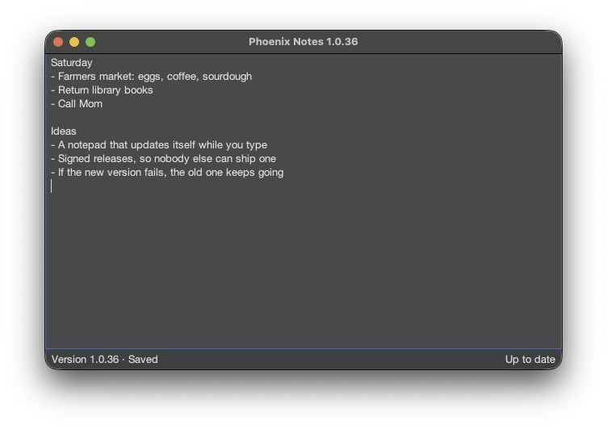

# Phoenix Notes

A desktop notepad that keeps itself up to date. It downloads signed releases, verifies them, and
hands over to the new version while it's running, falling back to the old one if the new one fails.

An exercise in safe, seamless self-updating software.



**Status:** work in progress. Design decisions are in [docs/decisions](docs/decisions/README.md).

## Installing

Download the installer for your computer from the
[latest release](https://github.com/lewisenator/PhoenixNotes/releases/latest). Each one includes
its own Java, and installs for you alone, without admin rights (except on Linux). After that the
app keeps itself up to date: an old installer always starts the newest version it has downloaded.

| OS | File | Install | Uninstall |
|----|------|---------|-----------|
| macOS (Apple silicon) | `Phoenix Notes-<version>.dmg` | Open it and drag the app to Applications. | Move the app to the Bin. |
| Windows | `Phoenix Notes-<version>.msi` | Run it. It adds a Start menu entry and a desktop shortcut. | Settings → Apps. |
| Linux (Debian, Ubuntu) | `phoenix-notes_<version>_amd64.deb` | `sudo apt install ./phoenix-notes_*.deb` | `sudo apt remove phoenix-notes` |

The installers aren't signed by Apple or Microsoft, so the first launch needs one extra step:

- **macOS:** it says the app can't be checked for malware. Open *System Settings → Privacy &
  Security*, and click *Open Anyway* next to Phoenix Notes.
- **Windows:** SmartScreen says it protected your PC. Click *More info*, then *Run anyway*.

Updates themselves are always checked against the app's signing keys, so these warnings are about
the installer only ([decision 0017](docs/decisions/0017-installers.md)).

**Anywhere else** (an Intel Mac, say), install Java 25 and run the release's jar:
`java -jar app-<version>.jar`. It updates itself the same way.

Uninstalling leaves your note and downloaded versions behind, in
`~/Library/Application Support/PhoenixNotes` (macOS), `%LOCALAPPDATA%\PhoenixNotes` (Windows) or
`~/.local/share/phoenixnotes` (Linux). Files you opened are never touched.

## How updates work

There's no separate launcher: each version knows how to update itself, so the update code and the
trusted keys ship with every release ([decision 0004](docs/decisions/0004-one-self-updating-program.md)).

1. **Release.** Every push to `main` that passes the checks on all three OSes becomes version
   `1.0.<commit count>`. CI signs its manifest (version, download URL, size, SHA-256) and publishes
   it with the jar, the installers and the public key chain.
2. **Check.** The app checks at startup, every 15 minutes, and from Help → Check for Updates. It
   fetches the key chain first, so a just-rotated key is trusted, then the manifest, which it only
   reads once the signature checks out.
3. **Install.** A newer release's jar is downloaded and installed in its own folder, if its size
   and hash match the manifest. Nothing running is ever overwritten.
4. **Hand over.** The running version starts the new one and waits for it to say it's ready, saves
   the note, and passes it the window's position. The new version opens in the same place and says
   it's running; only then does it become current, and the old one exits. If it doesn't make it, the
   old one stops it and carries on ([decision 0014](docs/decisions/0014-handoff.md)).
5. **Start.** Every start re-verifies the current version before running it, so an installer
   from long ago still starts the newest version it has downloaded.

## Questions and assumptions

The challenge leaves some questions open. These are the answers I guessed, and built for:

| Question | Assumed answer |
|----------|----------------|
| Who runs the program? | People at their own computers, on Windows, macOS or Linux, without admin rights. |
| How soon should a new version reach them? | Within minutes, without anyone doing anything. Checks run every 15 minutes, at startup, and on demand. |
| What does "seamlessly replaced" mean? | While it's running, without a restart, keeping what they were doing: the note, the open file and the window's position. A few seconds of a clear "Updating…" is fine. |
| Should it ask before updating? | No. Updates apply as soon as they're verified ([decision 0015](docs/decisions/0015-automatic-updates.md)). |
| What server do I need? | None of my own. Releases are static files on GitHub; trust comes from signatures, not from the host. |
| How do we make sure only we can ship a version? | Signed manifests, checked against keys built into the app, with rotation and an emergency replacement ([decisions 0008](docs/decisions/0008-signed-releases.md), [0009](docs/decisions/0009-key-rotation.md)). |
| What if a release is broken? | Running copies keep running the old version and skip the broken one; the next release fixes it. |
| Can we roll back? | Roll forward instead: release a fix. Apps never install an older version, so nobody can push one on them. |
| What if they're offline? | It keeps running the version it has, and tries again later. |
| Do installers need to be signed by Apple and Microsoft? | Not for this exercise. It costs one extra click on first install; updates don't depend on it ([decision 0017](docs/decisions/0017-installers.md)). |
| Does the updater need updating? | Yes, so it isn't separate: every release includes it. |

## Security

Releases are trusted because of who signed them, not where they came from. What that protects
against, and what it doesn't, is in [decision 0013](docs/decisions/0013-threat-model.md). In short:

- **Signed releases:** a manifest is checked against the app's keys before a byte of it is read,
  and the jar must match its size and SHA-256 hash.
- **Keys that can be replaced:** a leaked CI key is fixed by a rotation, signed with a key that
  never leaves 1Password; a lost one by the break-glass key. No reinstalling either way.
- **Verified before every run:** installed versions are checked again each time they start, so a
  version changed on disk doesn't run.
- **Never backwards:** apps only install newer versions, so an old, flawed release can't be pushed
  on anyone.
- **No secrets on disk:** private keys live in 1Password and a GitHub secret, and are only ever
  passed on standard input or in environment variables.

## Layout

| Module     | What it is                                                           |
|------------|----------------------------------------------------------------------|
| `app/`     | The notepad, and everything it needs to update itself               |
| `signing/` | Release manifests and signing keys, plus a command-line tool for CI |

In `app`, the top package starts the app (`Main`, `Startup`) and owns the data folder; `ui` is the
window; `update` is everything about finding, installing and handing over to new versions. The
two workflows, `Startup` and `Update`, read top to bottom as chains of steps, each logging a line.

## Building

Needs a JDK 17 or newer to run Gradle; the build downloads Java 25 if it isn't installed.

```bash
./gradlew build
```

To build the installer for the computer you're on (into `app/build/installer`):

```bash
./gradlew :app:installer
```

## Signing keys

Releases are signed with keys that can be rotated, and replaced in an emergency, without
reinstalling anything ([decision 0009](docs/decisions/0009-key-rotation.md)):

| Key | Private key lives in | Signs |
|-----|----------------------|-------|
| **current** | GitHub secret `PHOENIXNOTES_SIGNING_KEY` | Every release |
| **next** | 1Password | The rotation that makes it current |
| **break glass** | 1Password | An emergency replacement of every key |

The public keys are in [`trust/keys.json`](trust/keys.json), a chain where each generation is
signed by a key the one before it trusts. It's built into the app and published with every
release.

| Command | When | What it does |
|---------|------|--------------|
| `./gradlew keysInit` | Once | Creates all three keys and generation 0. Refuses if any keys exist. |
| `./gradlew keysRotate` | Every few months, or if the CI key may have leaked | Next becomes current (in CI); a new next is created. Installed versions stay trusted. |
| `./gradlew keysBreakGlass` | If the next key is lost or may have leaked | Replaces all three keys; apps download their version again. Asks for confirmation. |

Private keys never touch the disk or appear in command arguments.

### Before you start

1. **Install the 1Password and GitHub command-line tools:**
   - macOS: `brew install 1password-cli gh`
   - Windows: `winget install AgileBits.1Password.CLI GitHub.cli`
   - Linux: see [1Password CLI](https://developer.1password.com/docs/cli/get-started/) and
     [GitHub CLI](https://github.com/cli/cli#installation)
2. **Sign in to 1Password:** in the 1Password app, turn on *Settings → Developer → Integrate with
   1Password CLI*. Check with `op vault list`. Keys go in the `Private` vault; to use another, set
   `PHOENIXNOTES_OP_VAULT`, e.g. `PHOENIXNOTES_OP_VAULT=Work ./gradlew keysRotate`.
3. **Sign in to GitHub** with an account that can manage this repository's secrets:
   `gh auth login`. Check with `gh secret list`.
4. **Run the commands from the repository root, on an up-to-date `main`.** On Windows, use
   `gradlew.bat` instead of `./gradlew`.

### Setting up the keys (once)

```bash
./gradlew keysInit
git add trust/keys.json && git commit -m "Signing keys" && git push
```

### Rotating the keys

```bash
git pull
./gradlew keysRotate
git commit -am "Rotate signing keys" && git push
```

### Replacing every key (break glass)

```bash
git pull
./gradlew keysBreakGlass      # type "break glass" when asked
git commit -am "Replace signing keys" && git push
```

After each one, **push `trust/keys.json` straight away**: until it's on `main`, releases fail CI's
check rather than shipping with a key apps don't trust yet.

**If a command fails partway:** each one checks everything before changing anything, and replaced
1Password items are archived, not deleted. Restore anything archived from 1Password's Archive,
discard the `trust/keys.json` change (`git checkout -- trust/keys.json`), and run it again.